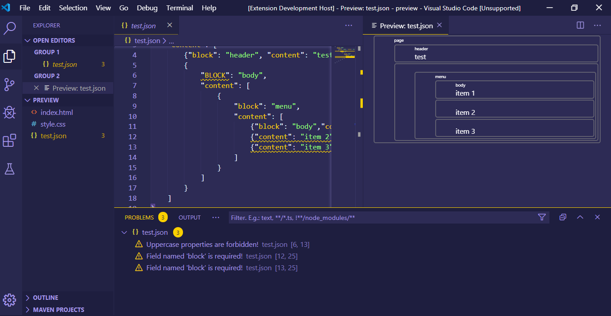
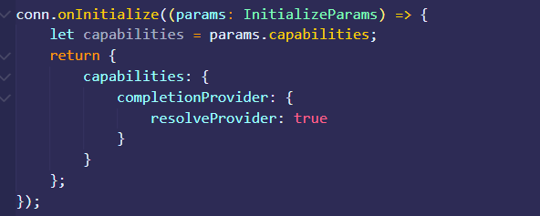
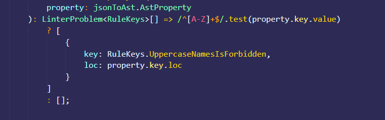
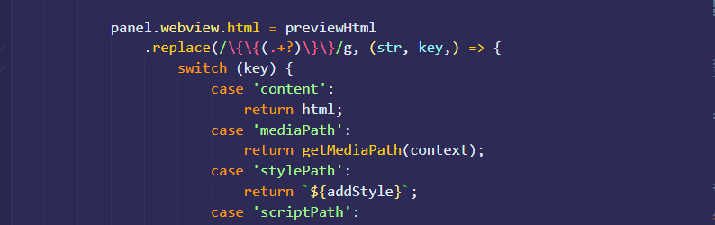
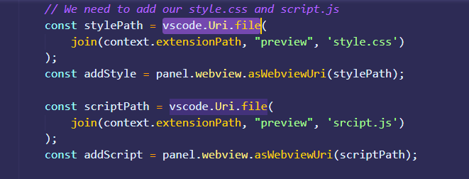
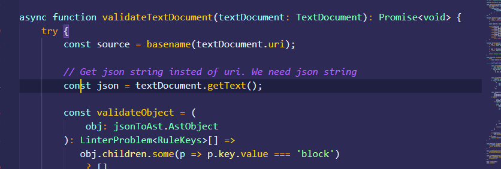
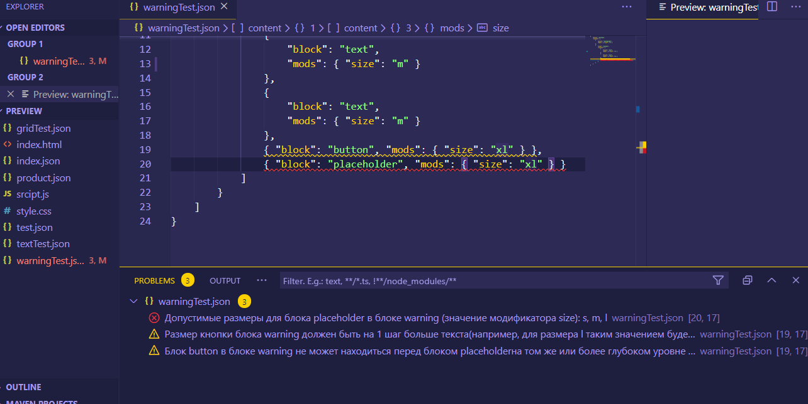

## ВАЖНО!!! 
## ОЧЕНЬ ХОЧУ В ШКОЛУ РАЗРАБОТКИ ИНТЕРФЕЙСОВ - ЭТО ТОЖЕ ВАЖНО!!!
Я очень внимательно наблюдал за вопросами которые обсуждались в Issues. Прочитав один из них https://github.com/yndx-shri-reviewer/shri-2020-task-3/issues/3, было принято решение создать две ветки:
1. Демонстрация того, что ошибки найдены (проверка на блоки и заглавные буквы работает): **git checkout template**. (Сменил в конце на более простое название).



2. Демонстрация того, что мой линтер подключен и работает, можно посмотреть в ветке мастера: **git checkout master**.

Так-как второе задание было решением с использованием javascript, для его подключения к проекту я воспользовался инструкцией на stack-overflow:
https://stackoverflow.com/questions/53516859/how-to-import-javascript-module-in-typescript.
Однако, это не помогает, если есть необходимость перенести весь линтер прямо на сервер и подключаться к нему там. Чтобы не менять весь код, который есть в проекте и не дай бог все поломать, чего я очень сильно опасаюсь, было принято решение описать свой линтер в ts файле по примеру "json-to-ast.d.ts'. С typescript мне приходится работать первый раз в жизни, и несмотря на то, что есть документация и там все понятно расписано, в чужом проекте подтягивать свои данные не так просто, как хотелось.

## ПОИСК ОШИБОК - ХОД МЫСЛЕЙ

1. Первые шаги, выполнять было просто. В консоле пишет ошибку, и показывает, где она существует. Достаточно было гуглить, и читать документацию от Microsoft.
Например рисунок ниже:



Я нашел пример кода, где данный фрагмент был объявлен именно в таком варианте, и вставив его, ошибка исчезла. Это незнакомый мне проект и я не работал с данными инструментами, поэтому данный результат меня обрадовал.



Также была проблема с "property.key.loc", если мне не изменяет память. Где-то я убрал "key", потому что не нашел его в интерфейсе в файле "json-to-ast.d.ts". В общем, key там был лишним, и так-как после изменений все работает корректно, следовательно там было все верно. **(P.S - Я был не прав)**.
По окончанию работы над проектом, мне хотелось сделать так, чтобы подчеркивание работало примерно также, как на скриншоте задания.
В итоге проблема была решена. Я так решал её в самом начале. В json-to-ast было добавлено поле "loc', которое отсутствовало в нужном нам интерфейсе "AstIdentifier".

2. В idex.html есть пункт {{content}}. Но он почему-то не выводил мне разметку из тестового json файла. Проблема была в регулярном выражении файла extension.ts. Через **switch** проверялось, наличие слова 'content' мужду скобками, и возвращается html. Проверяем, чем у нас являлась переменная html. Строкой с json. Следовательно, не работает само регулярное выражение.  Пример рисунок ниже:



Я не так силен в регулярных выражениях, но я был готов дать **100%**, что в интернете есть выражение, которое проверяет запись между двойными кавычками. Долго искать не пришлось, решение вывело буквально на первой из ссылок, все сразу заработало.


3. Вроде все выводит, но стилей нет: - **'Почему же так? В чем проблема?'**. Честно, очень долго искал причину. И это был большой плюс. Благодаря тому, что я перепробовал все возможное, мне не пришлось попасться на простые вещи. Где-то на середине поиска решил вставить стили прямо в файл index.html. И о боже, ничего не работает. Почему? Потому что перед "div", стоит точка. Но это же не класс: - "А Яндекс хитрые ребята!". Если бы я это не нашел сразу, кто знает, может найдя правильное решение, ничего бы не заработало, и я бы сидел в депрессии. Однако, после того, как я убрал точки, все заработало. Ответ был очевиден, пути тут надо настроить как-то по-особенному.
Решение было найдено на одном из сайтов, внимательно прочитав все заработало. 
Вот ссылка, в пункте "Loading local content"
https://code.visualstudio.com/api/extension-guides/webview#loading-local-content




Ну и затем мы их возвращаем)


4. Следующей проблемой было то, что не выводило ошибки. Тут все просто (На самом деле нет, я понятия не имею сколько нужно нервов и терпения, но у меня как-то хватило). Просто ищем через console.log(). Так-как я пробежался уже практически по всем файлам, предполагалось, что проблема либо в файле linter.js, либо в server.js. Одна из ошибок была на стороне сервера, там в json передавалось что-то непонятное (вроде бы ссылка). А надо было текст. Решена проблема была методом проб и ошибок.



Ну и также, я очень долгое время не мог понять, почему все работает, но не выводит ошибки. Запускал логи во всех функциях и смотрел какая может не работать. Но меня очень сильно смущал метод concat, у ошибок и после того, как я поменял его на push, все заработало. Тут ход мыслей - **Я понятия не имею, почему все так просто, но я так долго сидел и не мог понять**.

Я описываю все эти проблемы, уже после проделанной работы. Возможно я что-то упустил, но вроде по основным ошибкам, которые были найдены я прошелся. Я не использовал никаких сторонних библиотек. Я просто гуглил, и думал, а еще делал console.log. Если меня научат в яндекс школе делать это быстрее, мне еще сильнее хочется к вам попасть!!




Последним шагом необходимо было сделать возможность смены настроек вывода ошибок. Моей задачей было сделать все так, чтобы мой линтер работал как надо и ничего не сломать. Так-как у меня уже был свой перебор в линтере и свой поиск ошибок, пришлось избавиться от ненужных функций валидации в старом коде. Я решил в описании линтера добавить еще один интерфейс в который будет приниматься только одно значение **'key'**. В нашем случае, это тип ошибки, возвращаемый из нашего линтера. У нас уже есть файл **'configuration.ts'**, где заданы все настройки. Очень удобная и красивая архитектура кода, которую не хотелось менять и портить. Поэтому я добавил туда свои правила, и прописал их в package.json. Новый, созданный мной интерфейс принимает в себя правила типа **'RuleKeys'**, поэтому мы можем свободно его заполнять и уже затем отправлять в функции: **GetSeverity()** , **GetMessage()**. Следовательно, я создал просто отдельную функцию **getRulesKeys()**, которая принимает типы моих ошибок из линтера, сравнивает их с перечислением 'RuleKeys', из наших конфигураций, заполняет наш новый интерфейс, которые в дальнейшем позволяет нам работать, как это было изначально задумано создателями.
<br>
В итоге:
1.	Я заполнил свои правила в **configuration.ts**, и настроил **SeverityConfiguration**.
2.	Произвел необходимые заполнения в **package.json**.
3.	Создал свой интерфейс, куда мы записываем наши **'RuleKeys'**, в случае если ошибка есть и ее нужно будет отобразить.
4.	Создал функцию, которая сравнивает, есть ли у нас ошибки и есть ли у нас такое перечисление правил в конфигурациях, и если есть, то возвращает нам **'RuleKeys'**, с которыми мы можем дальше работать.

**Функция getRulesKeys.**
```ts 
const getRulesKeys = (key: any): RuleList<RuleKeys> => {
    switch(key) {
        case RuleKeys.WarningInvalidButtonPosition: 
            return { key: RuleKeys.WarningInvalidButtonPosition};
        case RuleKeys.WarningInvalidButtonSize:
            return { key: RuleKeys.WarningInvalidButtonSize};
        case RuleKeys.WarningInvalidPlaceholderSize:
            return { key: RuleKeys.WarningInvalidPlaceholderSize};
        case RuleKeys.WarningTextSizeShouldBeEqual: 
            return { key: RuleKeys.WarningTextSizeShouldBeEqual};
        case RuleKeys.GridTooMuchMarketingBlocks:
            return {key: RuleKeys.GridTooMuchMarketingBlocks};
        case RuleKeys.TextSeveralH1:
            return {key: RuleKeys.TextSeveralH1};
        case RuleKeys.TextInvalidH2Position:
            return {key: RuleKeys.TextInvalidH2Position};
        case RuleKeys.TextInvalidH3Position:
            return {key: RuleKeys.TextInvalidH3Position};
    }
    
    return key;
};
```

**Не забудьте принять меня в яндекс школу, пожалуйста!!!**
<br>
**P.S. Прошу прощение за ужасные скриншоты. По-другому делать не умею).**

## ОТЗЫВ
Очень классное задание. Я очень многое узнал про язык TS, и немного разобрался с новым API. Было очень интересно искать ошибки и настраивать чтобы все работало. Я чувствую себя довольным на все 100%. Может быть надо лучше, может быть есть инструменты, которые все упрощают, но я сделал это по своему. Как мы выражаемся в сборной хакатонщиков **Russianhackteam** - **Сделал по незнанке.**
Очень хотелось бы попасть в школу разработчиков интерфейсов, узнать много нового и конечно же поучаствовать в моих любимых хакатонах, которые также обещают провести в вашей школе. !!! Спасибо Диме и всем тем, кто составлял данное задание. Оно оказалось для меня самым сложным, но моим самым любимым заданием.
